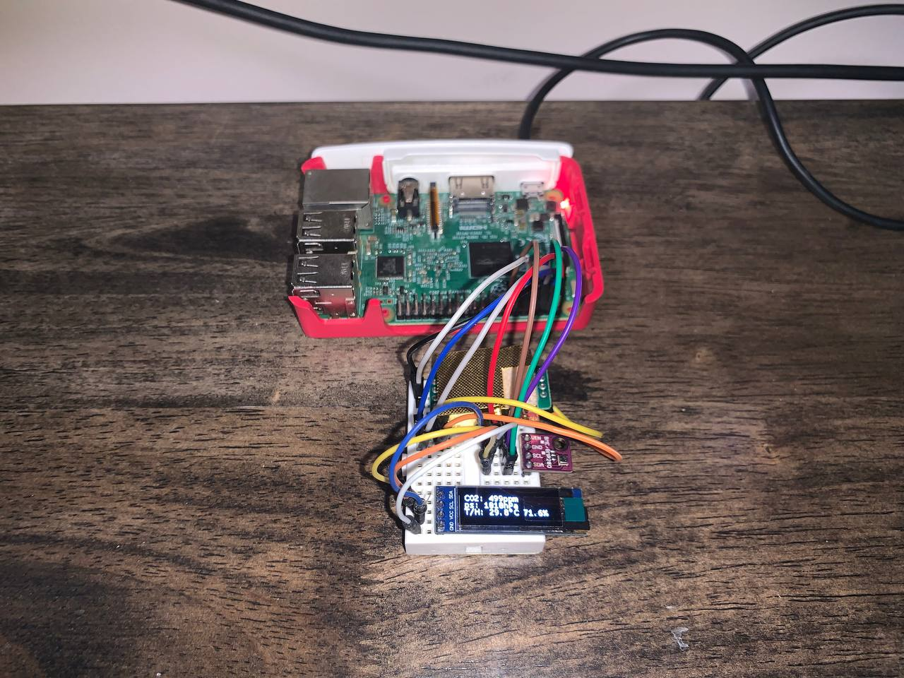
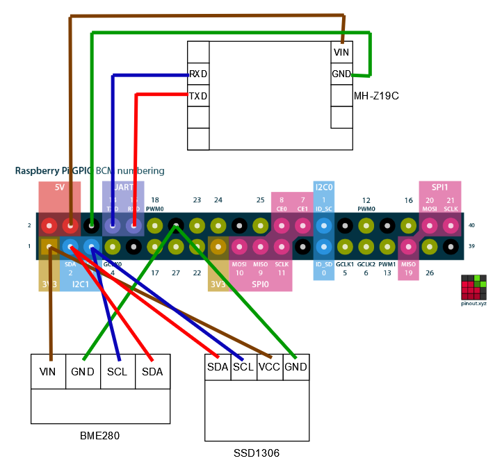

# Air Quality Dashboard for Raspberry Pi

This repository contains all the iterations of my air quality dashboard for my Raspberry Pi. The code is built around the Raspberry Pi's GPIO interfacing with a BME280 sensor (for temperature, pressure and humidity) and a MH-Z19C sensor (for CO2 concentration).

* [Link to the BME280 Sensor](https://www.aliexpress.com/item/32849462236.html)
* [Link to the MH-Z19C Sensor](https://www.aliexpress.com/item/4001296615950.html)

## Revision 1



The first revision uses a 128px x 32px SSD1306 display to display the readings via the Raspberry Pi's I2C interface. As the BME280 interfaces with I2C as well, we have to connect both of them in parallel.



### Usage

Install the required pip packages with the following command.

```bash
python3 -m pip install -r requirements.txt
```

Enable your Raspberry Pi's I2C and Serial inputs with ```sudo raspi-config```.

- `Interface Options` > `I5 I2C` > `Yes`
- `Interface Options` > `I6 Serial Port` > `No` > `Yes`

To run the app, simply execute `app.py`.

```bash
python3 app.py
```

## Plans for the next revision

* Incorporate a Waveshare E-Ink dashboard, not only to show readings but also as a dashboard for other stuff.
* Rewrite this in Rust/Go for more power efficiency.

