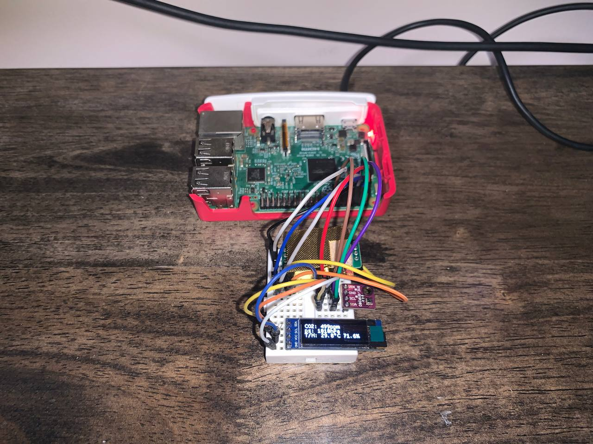

# Air Quality Dashboard for Raspberry Pi

This repository contains all the iterations of my air quality dashboard for my Raspberry Pi. The code is built around the Raspberry Pi's GPIO interfacing with a BME280 sensor (for temperature, pressure and humidity) and a MH-Z19C sensor (for CO2 concentration). All readings are logged down periodically (the default interval is *2 minutes*) into an SQLite3 database.

* [Link to the BME280 Sensor used](https://www.aliexpress.com/item/32849462236.html)
* [Link to the MH-Z19C Sensor used](https://www.aliexpress.com/item/4001296615950.html)

## Revision 1

The first revision is written in Python and uses a 128px x 32px SSD1306 display to display the readings via the Raspberry Pi's I2C interface. The code and documentation can be found in the [`rev1` directory](https://github.com/Polygonalr/pi-air-meter/tree/master/rev1).

## Revision 2

The second revision is built on Rust and uses a [Waveshare 7.5inch E-Ink V2 display](https://www.waveshare.com/7.5inch-e-paper.htm). This is still **under development** and not complete. The code and documentation can be found in the [`rev2` directory](https://github.com/Polygonalr/pi-air-meter/tree/master/rev2).

## License

[MIT License](/LICENSE)
