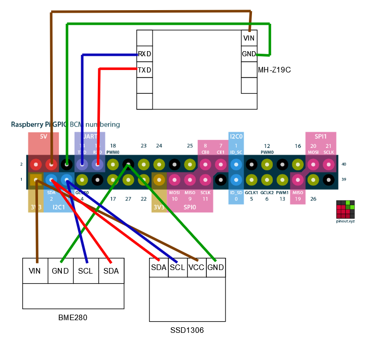

# Air Quality Dashboard for Raspberry Pi (Revision 1)

## Wire connection



As both the BME280 sensor and the SSD1306 display interfaces with I2C, both components have to be connected in parallel. It is still possible to interact with both components.

## Usage

Install the required pip packages with the following command.

```bash
python3 -m pip install -r requirements.txt
```

Enable your Raspberry Pi's I2C and Serial inputs with ```sudo raspi-config```.

- `Interface Options` > `I5 I2C` > `Yes`
- `Interface Options` > `I6 Serial Port` > `No` > `Yes`

To run the app, simply execute `app.py`.

```bash
python3 app.py
```
